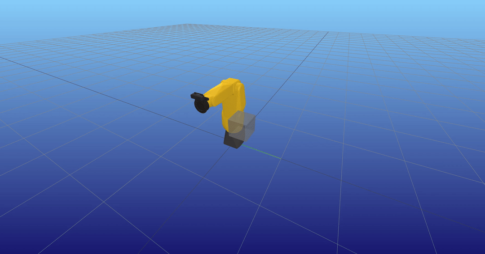
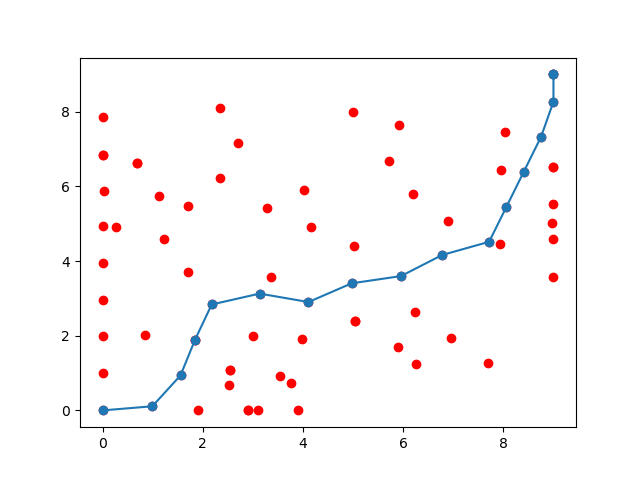
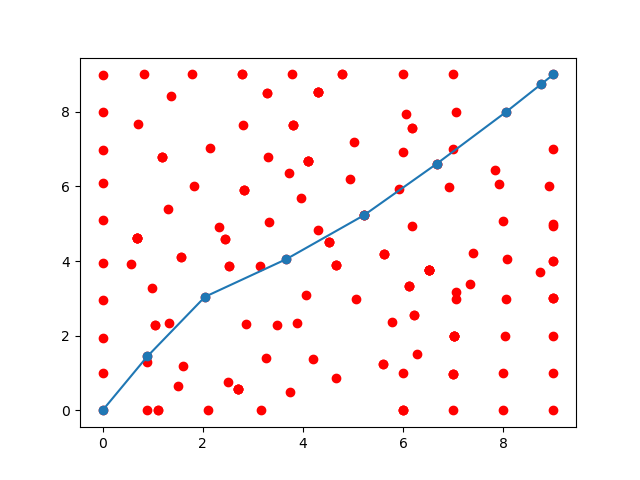
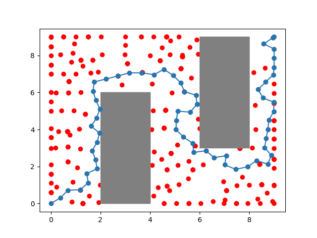
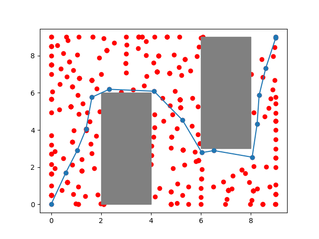

## Example + Test scripts

### RRT* for FANUC arm (with collision avoidance)



1. Fanuc RRT* Examples:
```bash
# Simple Example (no collision objects)
python3 rrt_start_q_eg.py

# Without Shortcut Impl (with collision objects)
python3 rrt_start_q_collision_eg.py

# With Shortcut Impl (with collision objects)
python3 rrt_star_q_collision_shortcut_eg.py
```

2. Fanuc Differential IK Example:
```bash
python3 differential_IK.py
```

---

### RRT vs. RRT* (2D - No Collision Objects)

 

Example Scripts:
```bash
# rrt 2d
python3 2D_rrt_eg.py

# rrt star 2d
python3 2D_rrt_star_eg.py
```

---

### RRT vs. RRT* (2D - With Collision Objects)

 

Example Scripts:
```bash
# rrt 2d
python3 2D_rrt_collision_eg.py

# rrt star 2d
python3 2D_rrt_star_collision_eg.py
```